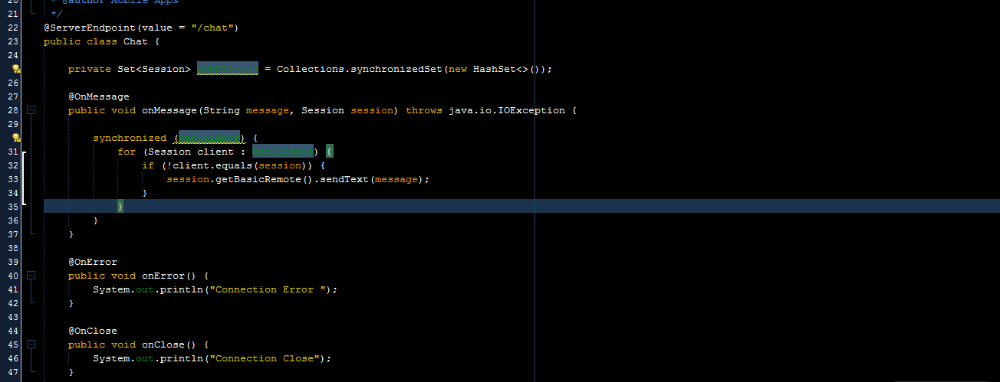
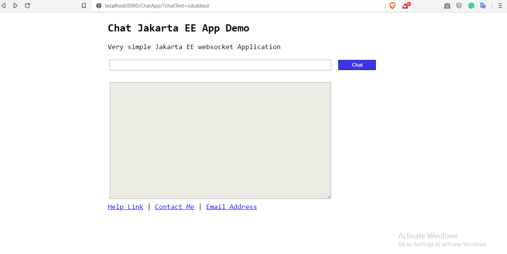
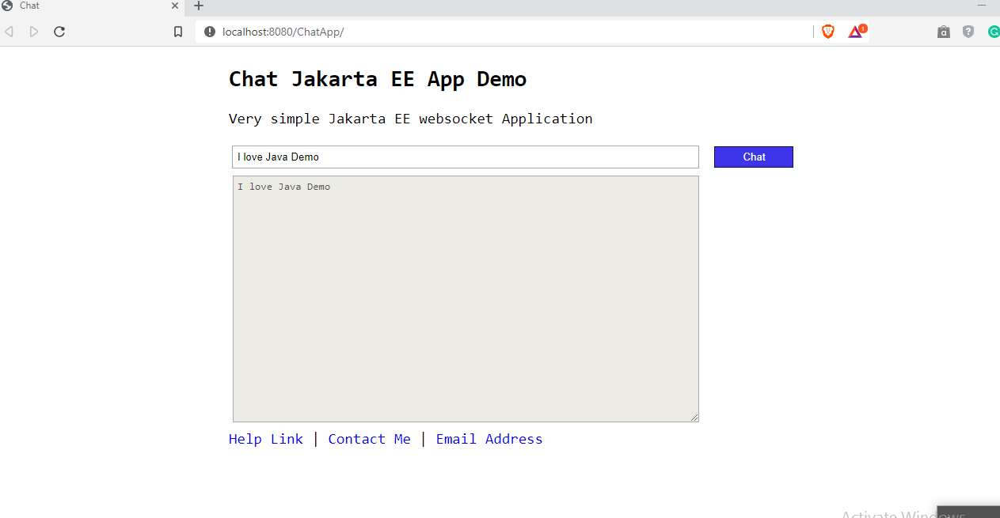
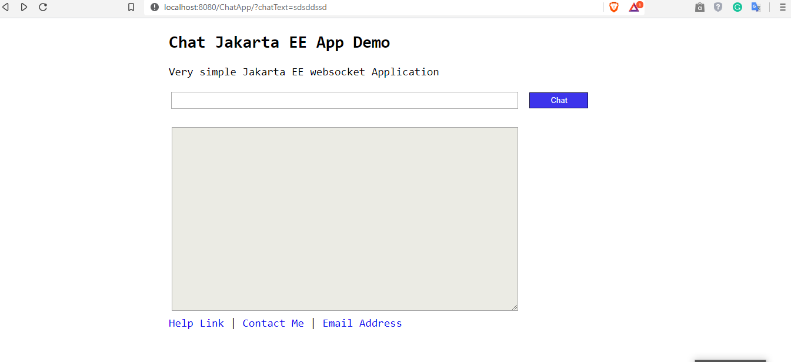

# Chat-App-Java
Chat Application Java Enterprise.
A chat application using websocket from html5 and back-end using Java language .
Developing full-duplex application is easy when using Java Entterprise /Jakart.

